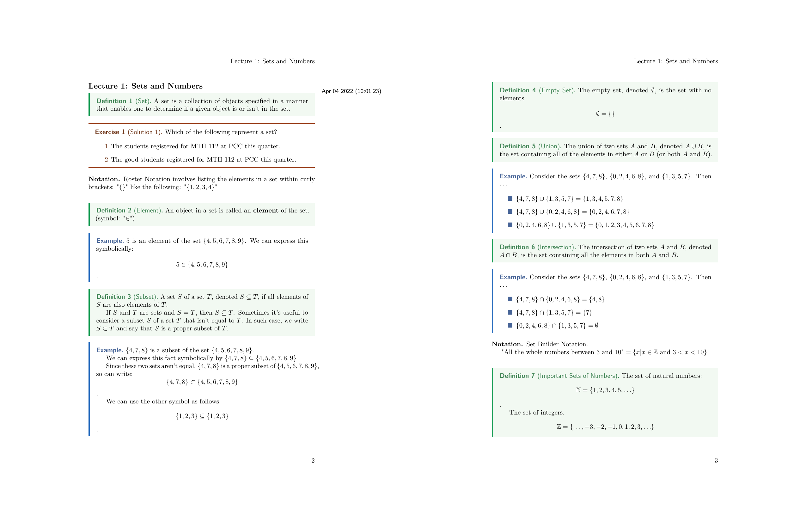
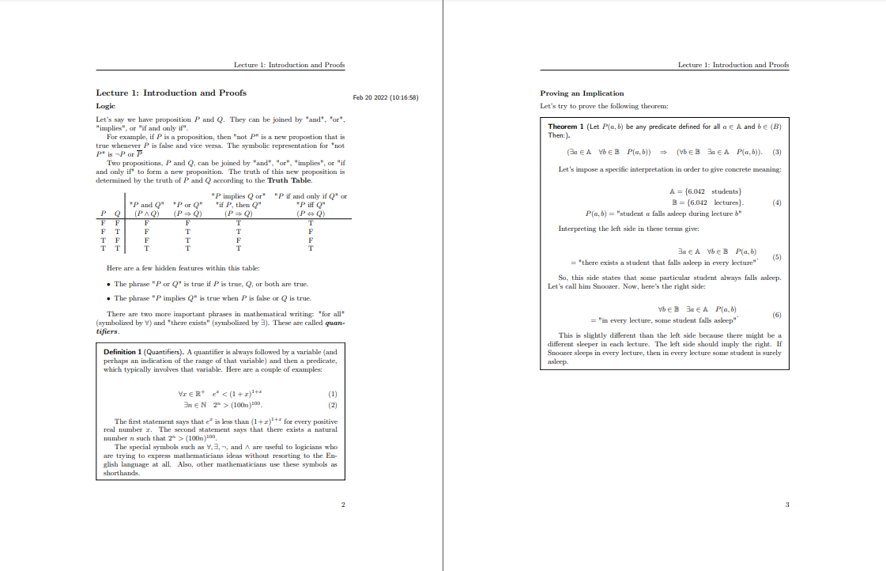

My Personal Notes
=================

# Gallery

## [Pre-Calculus 2](College/Year-1/semester-2/hs-pre-calculus-2)



## [Real Analysis](University/Math/RealAnalysis)



# File structure

```
ROOT
├── current-course -> ~/Documents/school-notes/College/Year-1/semester-2/hs-pre-calculus-2
├── College
│   ├── Year-1
│   │   ├── semester-1
│   │   │   └── hs-pre-calculus-2
│   │   │       ├── assignments
│   │   │       │   ├── images
│   │   │       │   │   ├── week-1.png
│   │   │       │   │   └── ...
│   │   │       │   ├── latex-files
│   │   │       │   │   ├── week-1.tex
│   │   │       │   │   └── ...
│   │   │       │   ├── master.tex
│   │   │       │   ├── pdf-files
│   │   │       │   │   ├── week-1.pdf
│   │   │       │   │   └── ...
│   │   │       │   └── preamble.tex
│   │   │       ├── figures
│   │   │       │   ├── circle-diagram.pdf
│   │   │       │   ├── circle-diagram.pdf_tex
│   │   │       │   ├── circle-diagram.svg
│   │   │       │   └── ...
│   │   │       ├── info.yaml
│   │   │       ├── lectures
│   │   │       │   ├── lec-1.tex
│   │   │       │   └── ...
│   │   │       ├── master.tex
│   │   │       ├── preamble.tex
│   │   │       ├── solutions.tex
│   │   │       └── source-lectures.tex
│   │   ├── semester-1
│   │   │   └── ...
│   │   └── ...
│   └── ...
└── ...
```

## Going over the file tree

### Current Course

`current-course` is a [symbolic
link](https://en.wikipedia.org/wiki/Symbolic_link) that points to one of the
classes in the current college year/current college semester. For example, if I
am in year 1 and semester 2 and I am working on math, it points me to
[Pre-Calculus 2](College/Year-1/semester-2/hs-pre-calculus-2/). I use scripts
to help me maintain all of my notes, which you can find them
[here](https://github.com/SingularisArt/school-setup).

### Source Lessons

The `source-lectures.tex` is a file that I use to source all of my
lessons/lectures in so I don't have to do it in my `master.tex`. Here is the
content:

```latex
...
\input{lectures/lec-5.tex}
...
```

The reason I do this is because I use a bunch of small scripts to do a lot of
things for me. For example, I have a script (you can check them out
[here](https://github.com/SingularisArt/school-setup)) that adds a new
lesson/lecture (you can check them out
[here](https://github.com/SingularisArt/school-setup/blob/master/RofiLessonManager/view_lessons.py)).

### Preamble Tex

The `preamble.tex` is a file that I use in every single `master.tex`. It has all of my default packages, commands, setup, etc.

### Info yaml

Contents of `info.yaml`
```yaml
title: Pre-Calculus II
short: PC 2
url: https://
```

### Master Tex

Contents of `master.tex`:

```tex
\documentclass{report}

\input{preamble.tex}

\title{Pre-calculus 2}
\author{Hashem A. Damrah}
\date{\today}

\begin{document}
  \maketitle
  \mbox{}\newpage
  \input{source-lectures.tex}
\end{document}
```

Nothing really fancy here. But, there's one thing to note.
You can add a parameter to the document class: `[nocolor]`. This gets rid of
the colored theorems and it will be just black and white.

### Lesson Tex

A lesson file contains a line

```latex
\lesson{1}{Sep 13 2021 Mon (10:54:11)}{Introduction}
```

which is the lesson number, date, and title of the lecture.

### Bibliography Bib

Contents of `bibliography.bib`

```bibtex
@book{milnor,
  title={Morse theory.(AM-51)},
  author={Milnor, John},
  volume={51},
  year={2016},
  publisher={Princeton university press}
}

...
```

I don't really use a `bibliography.bib` file, but I keep it there just in case.

### Figures

For my figures, I store them at the root directory of my class. For example, my
figures for pre-calculus are located at
`College/Year-1/semester-2/hs-pre-calculus-2/figures/`. Simple, yet clean!
