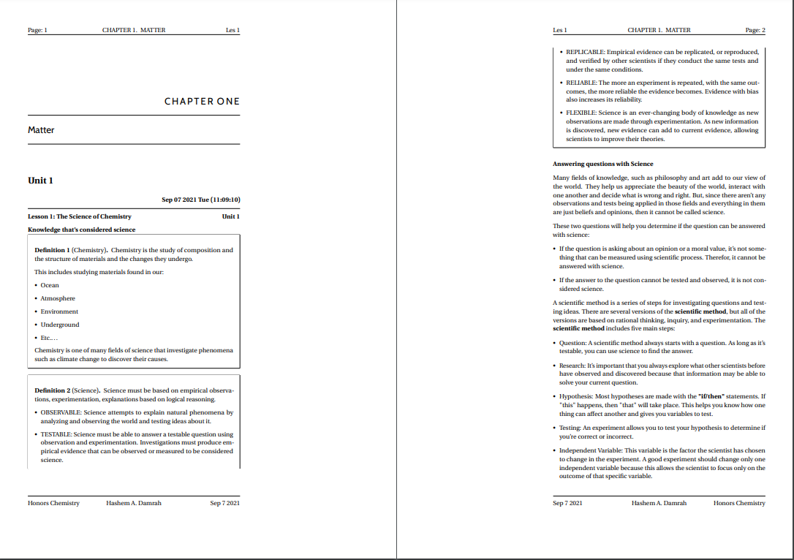
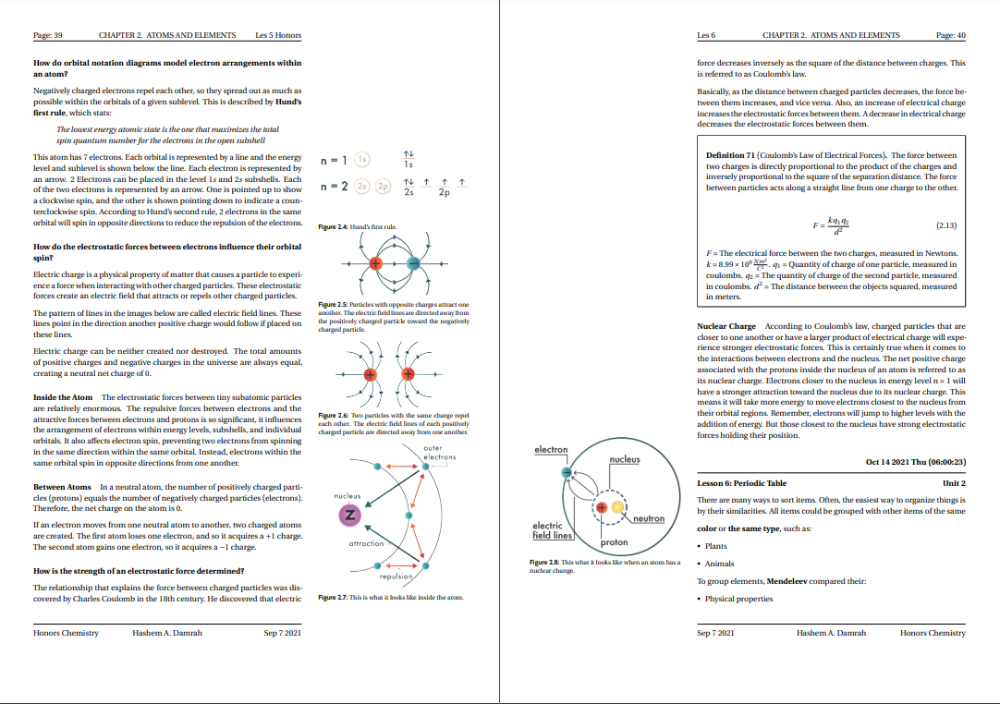
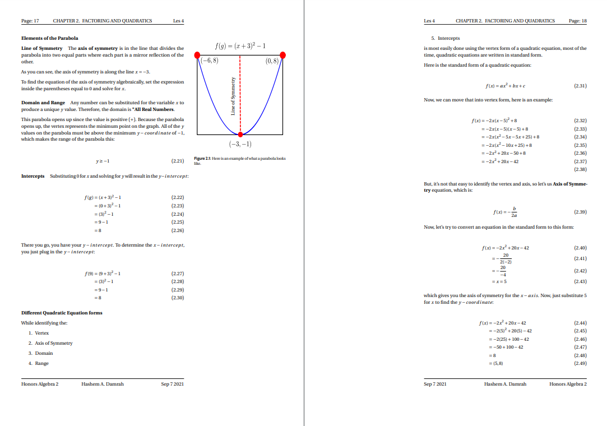

My Personal Notes
=================

# Gallery





# Table of Contents

* [Gallery](#gallery)
* [File Structure](#file-structure)
    * [Going over the file tree](#going-over-the-file-tree)
        * [Current Course](#current-course)
        * [Source Lessons](#source-lessons)
        * [Note Taking Class Cls](#note-taking-class-cls)
        * [Preamble Tex](#preamble-tex)
        * [Unit Info](#unit-info)
        * [Info yaml](#info-yaml)
        * [Master Tex](#master-tex)
        * [Lesson Tex](#lesson-tex)
        * [Lecture Tex](#lecture-tex)
        * [Bibliography Bib](#bibliography-bib)
        * [Figures](#figures)
* [My Scripts](#my-scripts)
   * [Rofi Current Course](#rofi-current-course)
   * [Rofi File Browser](#rofi-file-browser)
   * [Rofi Grades](#rofi-grades)
   * [Rofi Inkscape](#rofi-inkscape)
   * [Rofi Lessons](#rofi-lessons)
   * [Rofi New Lesson](#rofi-new-lesson)
   * [Rofi Nvim](#rofi-nvim)
   * [Rofi Source Code](#rofi-source-code)
   * [Rofi Web Browser](#rofi-web-browser)
   * [Rofi Yaml](#rofi-yaml)
   * [Rofi Zathura](#rofi-zathura)
* [What is LaTeX](#what-is-latex)
* [ToDo](#todo)

# File structure

```
~/Documents/notes/.
|
├── Grade-9
│   ├── semester-1
│   └── semester-2
├── Grade-10
│   ├── semester-1
│   ├── semester-2
│   │   ├── hs-algebra-2
│   │   │   ├── bibliography.bib
│   │   │   ├── conclusion.tex
│   │   │   ├── copyright.tex
│   │   │   ├── info.yaml
│   │   │   ├── master.tex
│   │   │   ├── preface.tex
│   │   │   ├── summary.tex
│   │   │   ├── unit-1
│   │   │   │   ├── lesson-1.tex
│   │   │   │   ├── ...
│   │   │   │   ├── lesson-35.tex
│   │   │   │   ├── ...
│   │   │   │   ├── unit-info.tex
│   │   │   │   ├── figures
│   │   │   │   │   ├── graphing-vectors.pdf
│   │   │   │   │   ├── graphing-vectors.pdf_tex
│   │   │   │   │   ├── graphing-vectors.svg
│   │   │   │   │   └── ...
│   │   │   ├── unit-2
│   │   │   │   ├── lesson-1.tex
│   │   │   │   ├── ...
│   │   │   │   ├── lesson-35.tex
│   │   │   │   ├── ...
│   │   │   │   ├── figures
│   │   │   │   │   ├── rate-of-change.pdf
│   │   │   │   │   ├── rate-of-change.pdf_tex
│   │   │   │   │   ├── rate-of-change.svg
│   │   │   │   │   └── ...
│   │   │   ├── note-taking-class.cls
│   │   │   └── preamble.tex
├── Grade-11
│   ├── semester-1
│   └── semester-2
├── Grade-12
│   ├── semester-1
│   └── semester-2
├── current-course
```

## Going over the file tree

### Current Course

`current-course` is a [symbolic link](https://en.wikipedia.org/wiki/Symbolic_link) that points to one of the classes in the current grade/current semester. For example, if I am in grade 9 and semester 2 and I am working on math, it points me to [honors algebra 2](Grade-10/semester-2/hs-algebra-2). I use scripts to help me maintain all of my notes, which you can find them [here](https://github.com/SingularisArt/Singularis/tree/master/local/scripts).

### Source Lessons

The `source-lessons.tex` is a file that I use to source all of my lessons/lectures in so I don't have to do it in my `master.tex`. Here is the content:

```latex
  % Unit 1 started
  \input{unit-1/unit-info}

  \input{unit-1/lesson-1}
  \input{unit-1/lesson-2}
  \input{unit-1/lesson-3}
  \input{unit-1/lesson-4}
  \input{unit-1/lesson-5}
  % Unit 1 ended
```

The reason I do this is because I use a bunch of small scripts to do a lot of things for me. For example, I have a script (you can check them out [here](https://github.com/SingularisArt/Singularis/tree/master/local/scripts/school)) that adds a new lesson/lecture (you can check them out [here](https://github.com/SingularisArt/Singularis/blob/master/local/scripts/school/rofi-new-lesson.py)).

I had to figure out a way for that script to add that newly made file to my `master.tex`. Then, it hit me. Why not just put all of the files I am going to source in a different file, then source that file in my `master.tex`. Genius!

### Note Taking Class Cls

The `note-taking-class.cls` file is a class file that I use when taking notes.

### Preamble Tex

The `preamble.tex` is a file that I use in every single `master.tex`. It has all of my default packages, commands, setup, etc.

### Unit Info

This `unit-info.tex` file contains the unit information. Here is an example file:

```latex
\chapter{Narrative Writing}

\section{Unit 1}
```

I put the information here, and then source it in [Source Lessons](#source-lessons).

### Info yaml

Contents of `info.yaml`
```yaml
title: 'Honors Linear Algebra'
short: 'HS LA'
url: 'https://'
grade: '100%'
```

### Master Tex

Contents of `master.tex`:
```tex
\documentclass[a4paper,11pt,openany]{tuftebook}

\input{../preamble}

\newcommand\theTitle{'TITLE'}
\newcommand\theauthor{'AUTHOR'}
\newcommand\thedate{'DATE'}

\title{\theTitle}
\author{\theauthor}
\date{\thedate}

\begin{document}

    \maketitle
    
    \pagestyle{plain}
    \renewcommand{\thepage}{Page: \roman{page}}
    
    \setcounter{page}{1}
    \setcounter{chapter}{0}
    
    \input{copyright.tex}
    \input{preface.tex}
    \input{summary.tex}
    
    \tableofcontents

    \pagestyle{fancy}
    \renewcommand{\thepage}{Page: \arabic{page}}
    
    \setcounter{page}{1}
    \setcounter{chapter}{0}
    
    \input{source-lessons}
    
    \printbibliography
    
\end{document}
```

The first few lines are creating the basic document. `\documentclass[a4paper,11pt,openany]{tuftebook}` creates the document. `\input{../preamble}` inputs my `preamble.tex` into the `master.tex`. Now, the reason for these:

```latex
\newcommand\theTitle{'TITLE'}
\newcommand\theauthor{'AUTHOR'}
\newcommand\thedate{'DATE'}

\title{\theTitle}
\author{\theauthor}
\date{\thedate}
```

is because I had some error when creating the `preamble.tex` when it came to the header and footer of the pdf. So, I created variables that the `preamble.tex` can use to add in the header and footer.
This `\maketitle` just creates the title of the page.

Now, this is where it gets fancy.

```latex
\pagestyle{plain}
\renewcommand{\thepage}{Page: \roman{page}}

\setcounter{page}{1}
\setcounter{chapter}{0}
```

This just sets the pagestyle, which is set to `plain`. The `\renewcommand{\thepage}{Page: \roman{page}}` makes the page numbering roman numerals. If you haven't noticed, you when you read the introduction pages of a book, they use roman numerals for page numbers. Then, once it comes for the actual information, they use regular numbers, which is what these lines do:

```latex
\tableofcontents

\pagestyle{fancy}
\renewcommand{\thepage}{Page: \arabic{page}}

\setcounter{page}{1}
\setcounter{chapter}{0}
```

Then, the last line `\input{source-lessons}`, just adds the file [source-lessons](#source-lessons).

### Lesson Tex

A lesson file contains a line
```latex
\lesson{1}{Sep 13 2021 Mon (10:54:11)}{Introduction}{Unit 1}
```
which is the lesson number, date, title of the lecture and unit number.

Also, when I want to create new subsections, I use `subsection*[]{}`, so it doesn't show up on the `table of content`, which ruins the look of the pdf.

### Lecture Tex

A lecture file (just like the [lesson file](#lesson-tex)) contains a line
```latex
\lecture{1}{Sep 13 2021 Mon (10:54:11)}{Introduction}{Unit 1}
```
which is the lesson number, date, title of the lecture and unit number.

Also, when I want to create new subsections, I use `subsection*[]{}`, so it doesn't show up on the `table of content`, which ruins the look of the pdf.

### Bibliography Bib

Contents of `bibliography.bib`
```bibtex
@book{milnor,
  title={Morse theory.(AM-51)},
  author={Milnor, John},
  volume={51},
  year={2016},
  publisher={Princeton university press}
}

...
```

I don't really use a `bibliography.bib` file, but I keep it there just in case.

### Figures

For my figures (which I don't have any at the moment), I store them at the root directory of my class. For example, my figures for algebra 2 are located at `Grade-10/semester-1/hs-algebra-2/figures/`. Simple, yet clean!

# My Scripts

You can find my scripts [here](https://github.com/SingularisArt/Singularis/blob/master/local/scripts/school). They are all pretty self explanatory, but I'll still go over them:

## Rofi Current Course

## Rofi File Browser

## Rofi Grades

## Rofi Inkscape

## Rofi Lessons

## Rofi New Lesson

## Rofi Nvim

## Rofi Source Code

## Rofi Web Browser

## Rofi Yaml

## Rofi Zathura

# What is LaTeX

# ToDo

- [x] Talk about my scripts.
- [x] Expand more on the [Lesson tex](#lesson-tex), [Lecture tex](#lecture-tex) and [Master tex](#master-tex) section.
- [x] Talk more about my [Figures](#figures)
- [ ] Talk more about my [Scripts](#my-scripts)
- [ ] Add gif of me using my scripts.
- [ ] Add pictures of how my notes look like when using this setup.
- [ ] Add [What is LaTeX](#what-is-latex) section.
