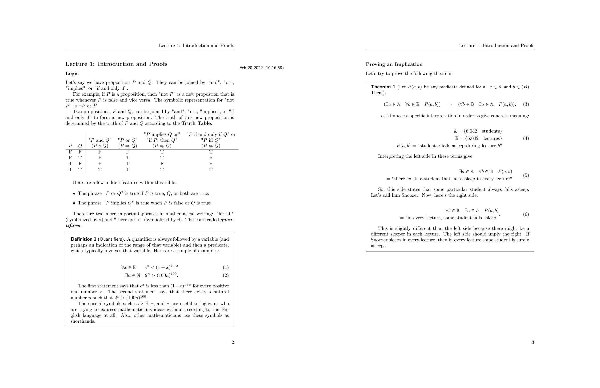

My Personal Notes
=================

# Gallery

## [Pre-Calculus 2](College/Year-1/semester-2/hs-pre-calculus-2)


## [Real Analysis](University/Math/RealAnalysis)



# File structure

```
.
├── College
│   ├── Year-1
│   │   ├── semester-1
│   │   │   ├── hs-pre-calculus-2
│   │   │   │   ├── assignments
│   │   │   │   │   ├── image-files
│   │   │   │   │   │   ├── week-01.png
│   │   │   │   │   │   ├── week-02.png
│   │   │   │   │   │   ├── week-03.png
│   │   │   │   │   │   └── ...
│   │   │   │   │   ├── figures
│   │   │   │   │   │   ├── diagram_of_trig.pdf
│   │   │   │   │   │   ├── diagram_of_trig.pdf_tex
│   │   │   │   │   │   ├── diagram_of_trig.svg
│   │   │   │   │   │   └── ...
│   │   │   │   │   ├── latex-files
│   │   │   │   │   │   ├── week-01.tex
│   │   │   │   │   │   ├── week-02.tex
│   │   │   │   │   │   ├── week-03.tex
│   │   │   │   │   │   └── ...
│   │   │   │   │   ├── Makefile
│   │   │   │   │   ├── master.tex
│   │   │   │   │   ├── pdf-files
│   │   │   │   │   │   ├── week-01.pdf
│   │   │   │   │   │   ├── week-02.pdf
│   │   │   │   │   │   ├── week-03.pdf
│   │   │   │   │   │   └── ...
│   │   │   │   │   ├── preamble.tex
│   │   │   │   │   └── yaml-files
│   │   │   │   │       ├── week-01.yaml
│   │   │   │   │       ├── week-02.yaml
│   │   │   │   │       ├── week-03.yaml
│   │   │   │   │       └── ...
│   │   │   │   ├── books
│   │   │   │   │   └── algebra_trigonometry.pdf
│   │   │   │   ├── info.yaml
│   │   │   │   ├── lectures
│   │   │   │   │   ├── lec-01.tex
│   │   │   │   │   ├── lec-02.tex
│   │   │   │   │   ├── lec-03.tex
│   │   │   │   │   └── ...
│   │   │   │   ├── Makefile
│   │   │   │   ├── master.tex
│   │   │   │   ├── papers
│   │   │   │   │   └── Pre-Shape Calculus: Foundations and Application to Mesh Quality Optimization -- Luft Daniel,Schulz Volker.pdf
│   │   │   │   ├── preamble.tex
│   │   │   │   ├── solutions.tex
│   │   │   │   ├── source-lectures.tex
│   │   │   │   └── UltiSnips
│   │   │   │       └── tex.snippets
│   │   │   └── ...
│   │   └── ...
│   └── ...
└── current-course
```
